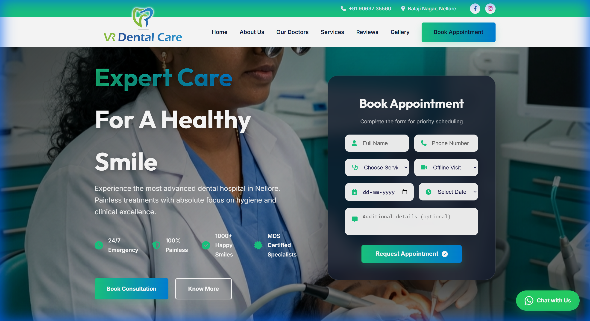
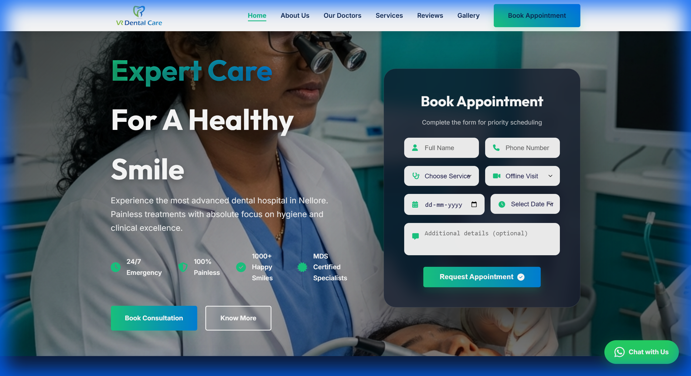
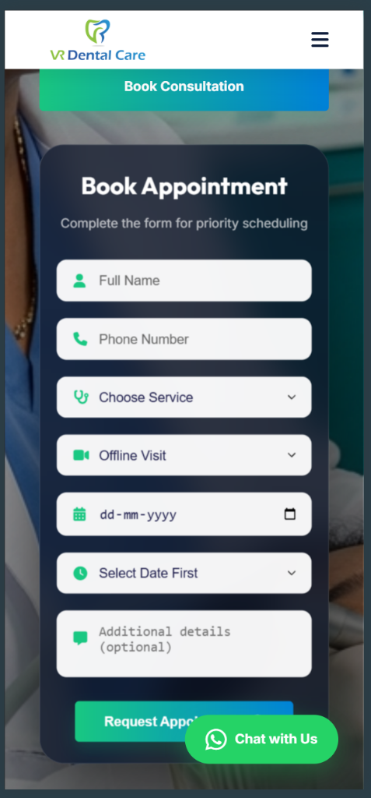
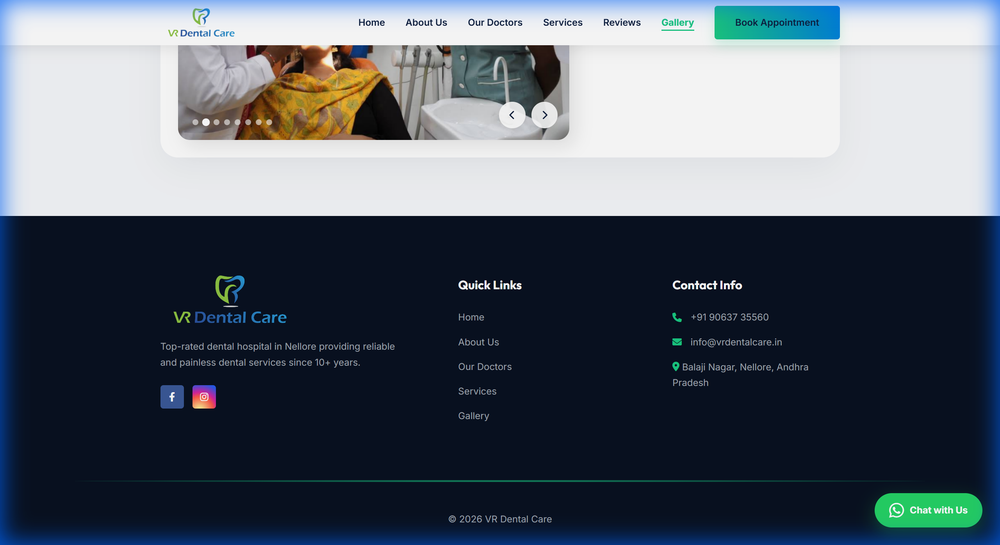

# VR Dental Care - Premium Dental Clinic Website

A modern, high-performance website for **VR Dental Care**, featuring a premium "Glasmorphism" UI, smart appointment scheduling, and seamless WhatsApp integration.

🔗 **Live Demo:** [VR Dental](https://amkreddy555.github.io/VRdental)

## ✨ Key Features

### 📅 Smart Appointment Scheduling
The appointment form includes built-in business logic to ensure bookings are only made during valid working hours:
*   **Mon - Sat:** 10:00 AM – 9:00 PM
*   **Sunday:** 10:00 AM – 2:00 PM
*   *Dynamic Time Slots:* The time dropdown automatically updates based on the selected day to prevent invalid bookings.

### 🎨 Premium "Modern Glow" UI
*   **Glassmorphism Effects:** Translucent cards with blur filters for a modern, high-end feel.
*   **Interactive Doctor Cards:** Vertical profile cards with hover animations, gradient badges, and integrated achievements.
*   **Responsive Design:** Fully optimized for Mobile, Tablet, and Desktop.

### 💬 Seamless WhatsApp Integration
*   **Direct Booking:** Form submissions are automatically formatted and sent directly to the clinic's WhatsApp.
*   **Pre-filled Messages:** Includes Patient Name, Service, Date, Time, and Consultation Mode.

## 📸 Screenshots

### Smart Booking Form
Dark-themed dropdowns and custom controls for a unified visual experience.

### Mobile Appointment Form
Optimized for smaller screens with full functionality.

### Integrated Footer
Clean navigation with custom separators and brand integration.

## 🛠️ Tech Stack
*   **Structure:** HTML5 (Semantic)
*   **Styling:** CSS3 (Variables, Flexbox, Grid, Animations)
*   **Logic:** Vanilla JavaScript (ES6+)
*   **Icons:** FontAwesome 6
*   **Fonts:** Inter & Outfit (Google Fonts)

---
*Deployed via GitHub Pages*
